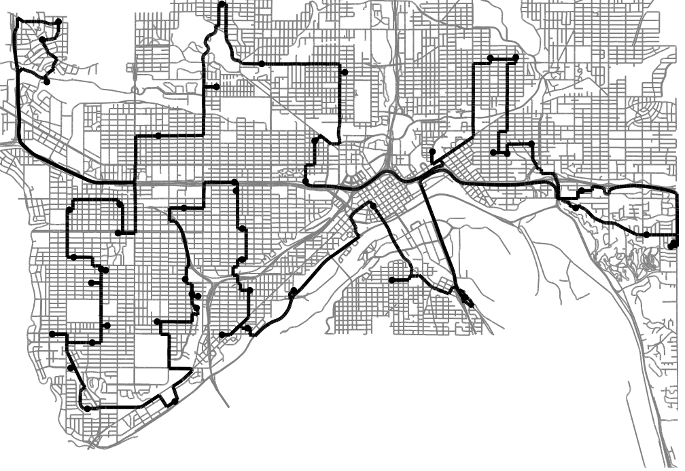

# Ramsey Middle School LEGO League Project

How can delivery trucks save gas and time by going the most efficient
way between deliveries?

get minnesota-latest.osm.pbf from
http://download.geofabrik.de/north-america/us.html

get the Saint Paul polygon from here
https://github.com/JamesChevalier/cities/blob/master/united_states/minnesota/saint-paul_minnesota.poly

Install Osmosis

Extract just Saint Paul from the Minnesota map with this command

osmosis --read-pbf-fast file=minnesota-latest.osm.pbf --bounding-polygon file=saint-paul_minnesota.poly --write-xml file="sp.osm"
